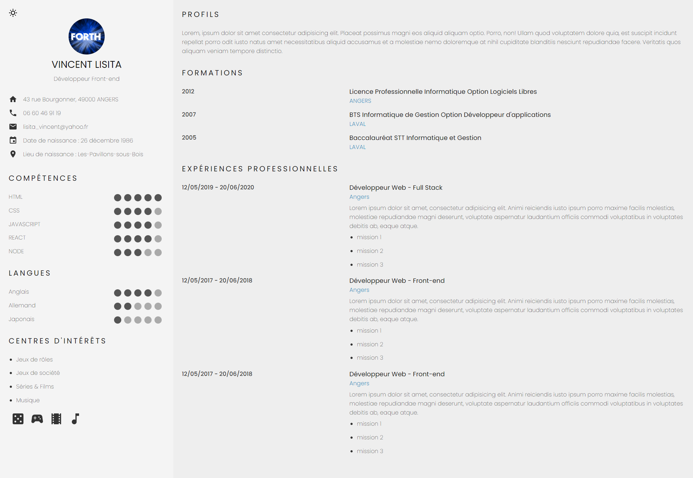
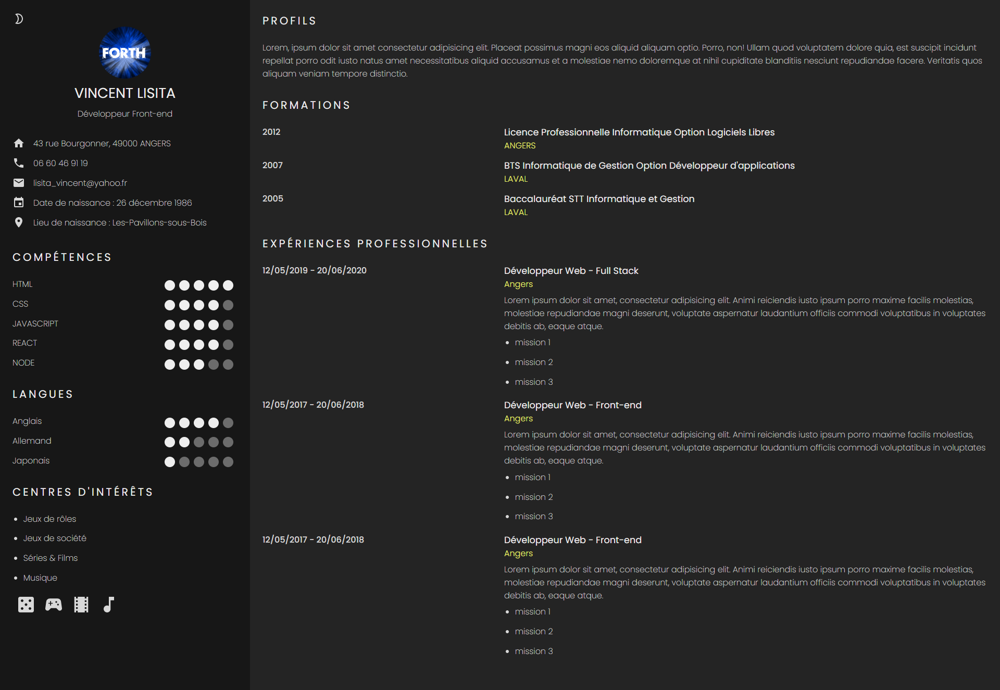
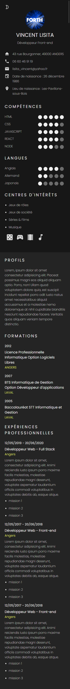

# Introduction

Projet développé à l'aide d'un cours vidéo : [Comment Créer un CV en Ligne en React.js (Hooks version 2021) - Tutoriel React pour Débutant](https://www.youtube.com/watch?v=V6VdW5J2juE). L'auteur utilise un bout de code trouvé sur ce lien : [Easy Dark Mode Switch with React and localStorage](https://aleksandarpopovic.com/Easy-Dark-Mode-Switch-with-React-and-localStorage/).

## Intérêts de ce projet

Ce projet a pour but de me familiariser à Réact. De plus, il utilise un système de mode sombre et clair, de plus en plus utilisé sur les sites. Il a aussi l'avantage de garder en mémoire le mode choisit pour le réutiliser ultérieurement. Et enfin, ce projet me montrera une façon de générer un pdf automatiquement.

Pour résumer, les intérêts seront de :
- Se familiariser à Réact
- Mettre en place un mode sombre
- Générer un pdf

## Problèmes rencontrés 

Le projet s'est bien déroulé dans l'ensemble. Toutefois le bouton pour le mode sombre n'était pas complètement opérationnel, tout comme la génération du pdf.

### Mode sombre

Le changement de mode était correctement pris en compte. L'auteur de la vidéo avait choisit d'ajouter un système d'état local (Hooks) qui posait des problèmes après un refresh. L'affichage du bouton n'était pas toujours celui correspondant au mode chargé. De plus, cet ajout n'apportait rien et complexifiait le code sans raison.

J'ai donc choisit de le retirer.

### Génération de PDF

Enfin, la génération du PDF a posé plusieurs problèmes. Le premier étant le manque de contrôles sur le PDF final. Le cv généré ne prenait en compte qu'une page en coupant à l'arrache le texte affiché en bas de page.

De plus, le block Preview utilisait pour générer l'affichage du PDF se mettait au premier plan ce qui empêchait la sélection du texte du cv ainsi que tous les liens disponibles tel que le bouton pour changer de mode, tel et mailto.

J'ai donc pris la décision de retirer cette partie pour le moment, le temps de trouver comment corriger cela. Pouvoir général automatiquement le PDF est un vrai plus, même si la pré-génération n'est pas un problème en soi.

## Améliorations apportées au projet

Je n'ai pas modifier grand chose. A part la correction du bouton de changement de mode et quelques retouches mineures tel qu'une transition lors du changement de mode ou des simplifications mineures du code, le projet est resté tel quel dans l'ensemble.

## Ce que m'a apporté ce projet

### Mode sombre

Tout d'abord, ce projet m'a montré une façon de mettre en place un mode sombre en réact. C'était pas si compliqué à mettre en place, même si l'état du bouton m'a poser quelques soucis. J'ai pu constater d'autres façons de faire cela tel qu'avec ThemeProvider. Je verrai pour faire avec dans un prochain projet !

### Material UI Icons

Ce projet utilise des icons SVG mis à disposition via Material UI. J'ai pu apprendre à utiliser des icons importés dans un projet Réact, ainsi que la façon de modifier leurs tailles facilement. Une belle découverte.

### Expérience Réact

Ce second projet m'a aidé à améliorer mes connaissances de Réact. J'ai aussi pu découvrir une façon différente d'utiliser le CSS. Le CSS est segmenté comme avec SASS, mais très répartir un peu partout dans le code (toutefois proche du Component principal qui l'utilise). Cela a au moins l'avantage de ne pas être compilé comme le demande SASS.

## Screenshots du résultat

Mode claire :

Mode sombre :

Affichage responsive sur mobiles :

